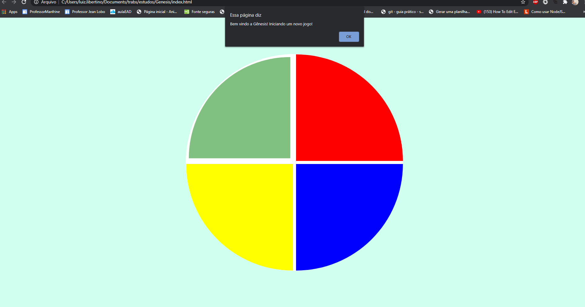

<h1 align="center">Gênesis</h1>

Jogo baseado no Gênesis, feito com Javascript, html e css. Proposto pelo curso de Desenvolvimento de jogos em Javascript da Digital Innovation One

<h4 align="center"> 
	🚧  React Select 🚀 Finalizando...  🚧
</h4>

<h1 align="center">
  
</h1>

### 🛠 Tecnologias

As seguintes ferramentas foram usadas na construção do projeto:

- [HTML](https://developer.mozilla.org/pt-BR/docs/Web/HTML/HTML5)
- [CSS](https://www.w3schools.com/css/)
- [Javascript](https://developer.mozilla.org/pt-BR/docs/Web/JavaScript)

### Autor
---

<a href="http://raziisz.github.io/">
 
  
 <b>Luiz Felipe</b></a> <a href="http://raziisz.github.io/" title="Dev">🚀</a>

Feito com ❤️ por Luiz Felipe 👋🏽 Entre em contato!

 

